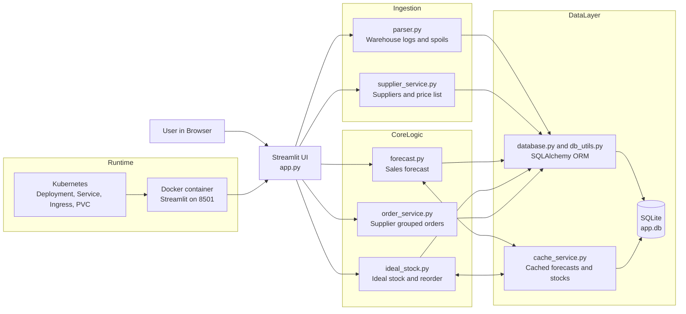

# Colizeum Item Stock

Streamlit application for inventory planning and purchasing decisions based on historical warehouse logs, spoilage data, and supplier price lists.

The app calculates:

- sales metrics and short-term forecasts (1, 2, 3, and 4 weeks)
- ideal stock levels using configurable safety settings
- recommended purchase orders grouped by supplier

## Features

- Excel-based data import for warehouse logs, spoils, suppliers, and price lists
- Automatic SKU normalization and deduplication at the database layer
- Net sales model: outbound sales minus spoils
- Cached forecast and ideal-stock calculations for faster UI response
- Supplier-aware order recommendations with packaging rounding and min-order checks
- SQLite persistence with lightweight startup migrations
- Deployment-ready Docker and Kubernetes manifests

## Tech Stack

- Python 3.11
- Streamlit
- Pandas / NumPy
- SQLAlchemy
- SQLite

## Project Structure

- `app.py` - Streamlit UI and workflow orchestration
- `parser.py` - Parsing and validation of uploaded Excel files
- `forecast.py` - Forecast model and metrics
- `ideal_stock.py` - Ideal stock and reorder quantity calculations
- `order_service.py` - Supplier-based recommendation builder
- `supplier_service.py` - Supplier and price-list ingestion
- `database.py` / `db_utils.py` - Models, DB setup, and data access helpers
- `cache_service.py` - Cache persistence helpers
- `scripts/backfill_uploaded_file_ranges.py` - Backfill utility for uploaded file date ranges
- `k8s/` - Kubernetes deployment manifests

## Architecture Diagram



High-level flow:

- Users interact with the Streamlit app.
- Uploaded Excel files are parsed and persisted via SQLAlchemy into SQLite.
- Forecast and stock modules read historical data, compute recommendations, and store cache entries.
- Order recommendations are built from ideal stock plus supplier and price-list data.
- The app runs in Docker and can be exposed through Kubernetes Ingress.

## Data Inputs

### 1. Warehouse logs

Expected format in `parser.py`:

- Excel with multi-row header
- SKU column: `Наименование`
- Balance columns: `Остаток на начало периода`, `Остаток на конец периода`
- Date columns in `dd.mm.yyyy` format (`.1` suffix is treated as outbound)

### 2. Spoils file

Expected format in `parse_and_save_spoils_file`:

- Header starts at row 2 (`header=1` in pandas)
- Required source columns by position:
  - A: date
  - E: SKU
  - F: quantity
  - H: reason

### 3. Supplier file

Required columns (single sheet):

- `поставщик`
- `контакт`
- `срок доставки`
- `цена доставки`
- `минимальный заказ`

### 4. Price list file

Expected structure in `save_price_list_file`:

- First 2 rows are header rows
- Required source columns by position:
  - B: item (SKU)
  - E: sale price
  - F: purchase price
  - G: discount
  - H: packaging
  - J: supplier

## Configuration

Environment variables:

- `SQLITE_PATH` (optional): path to SQLite database file
  - default: `app.db`
  - Kubernetes example: `/app/data/app.db`

Default business parameters (initialized in DB):

- `quote_multiplicator` = 1.0
- `min_items_in_stock` = 5
- `trend_period_weeks` = 8

These can be changed from the app UI.

## Local Run

### 1. Create virtual environment and install dependencies

```bash
python -m venv .venv
# Windows
.venv\Scripts\activate
# Linux/macOS
source .venv/bin/activate

pip install -r requirements.txt
```

### 2. Start application

```bash
streamlit run app.py
```

Open http://localhost:8501

## Docker

Build and run locally:

```bash
docker build -t itemstock:latest .
docker run --rm -p 8501:8501 -e SQLITE_PATH=/app/data/app.db -v itemstock_data:/app/data itemstock:latest
```

The container includes a health endpoint check at:

- `/_stcore/health`

## Kubernetes

Manifests are in `k8s/` and include:

- Deployment
- Service (ClusterIP)
- PVC (5Gi)
- Ingress (TLS via cert-manager)
- ClusterIssuer (`letsencrypt-prod`)

### Example apply flow

```bash
kubectl create namespace itemstock
kubectl apply -f k8s/pvc.yaml
kubectl apply -f k8s/deployment.yaml
kubectl apply -f k8s/service.yaml
kubectl apply -f k8s/cluster-issuer.yaml
kubectl apply -f k8s/ingress.yaml
```

Important:

- Current Deployment uses `imagePullPolicy: Never` and image `itemstock:latest`.
- This is suitable for local cluster workflows (for example, Minikube with local image load).
- For remote clusters, push image to a registry and update Deployment image and pull policy.

## Utility Script

Backfill `uploaded_files.date_from/date_to` from existing data tables:

```bash
python scripts/backfill_uploaded_file_ranges.py --dry-run
python scripts/backfill_uploaded_file_ranges.py
python scripts/backfill_uploaded_file_ranges.py --recompute-all
```

## Notes

- The UI labels are currently in Russian.
- The repository includes `app.db`; for production, use persistent volume storage and backups.
- Forecasts are linear over recent weekly history and clipped to non-negative values.

## User Guide (RU)

- Русская пользовательская инструкция: [USER_GUIDE_RU.md](USER_GUIDE_RU.md)

## License

No license file is currently included. Add one if you plan to distribute or open-source this project.
