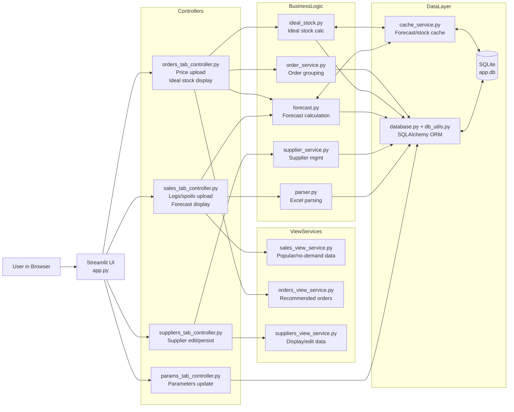

# Colizeum Item Stock

Streamlit application for inventory planning and purchasing decisions based on historical warehouse logs, spoilage data, and supplier price lists.

The app calculates:

- sales metrics and short-term forecasts (1, 2, 3, and 4 weeks)
- ideal stock levels using configurable safety settings
- recommended purchase orders grouped by supplier

## Features

- Excel-based data import for warehouse logs, spoils, suppliers, and price lists
- Automatic SKU normalization and deduplication at the database layer
- Net sales model: outbound sales minus spoils
- Cached forecast and ideal-stock calculations for faster UI response
- Supplier-aware order recommendations with packaging rounding and min-order checks
- SQLite persistence with lightweight startup migrations
- Deployment-ready Docker and Kubernetes manifests

## Tech Stack

- Python 3.11
- Streamlit
- Pandas / NumPy
- SQLAlchemy
- SQLite

## Project Structure

### Presentation Layer
- `app.py` - Streamlit UI orchestration (presentation-only, delegates to controllers)
- `ui_helpers.py` - Shared UI utilities (formatting, validation, i18n)

### Controller Layer (Business Workflow Orchestration)
- `sales_tab_controller.py` - Orchestrates sales tab (logs/spoils upload, forecast display)
- `orders_tab_controller.py` - Orchestrates orders tab (price upload, ideal stock, orders display)
- `suppliers_tab_controller.py` - Orchestrates suppliers tab (edit, detect changes, persist)
- `params_tab_controller.py` - Orchestrates parameters tab (load, validate, save, reset)

### Business Logic & Data Processing
- `parser.py` - Parsing and validation of uploaded Excel files
- `forecast.py` - Forecast model and metrics calculation
- `ideal_stock.py` - Ideal stock and reorder quantity calculations
- `order_service.py` - Supplier-based recommendation builder
- `supplier_service.py` - Supplier and price-list ingestion
- `sales_view_service.py` - Sales view data model builder (popular/no-demand products)
- `orders_view_service.py` - Orders view data model builder (recommended orders)
- `suppliers_view_service.py` - Suppliers view data model builder (display/edit)
- `forecast_schema.py` - Forecast column definitions and display formatting

### Data Layer
- `database.py` - SQLAlchemy ORM models and schema initialization
- `db_utils.py` - Session management, data loading/saving, parameters
- `cache_service.py` - Forecast and ideal-stock cache persistence

### Utilities & Infrastructure
- `scripts/backfill_uploaded_file_ranges.py` - Backfill utility for uploaded file date ranges
- `k8s/` - Kubernetes deployment manifests (Deployment, Service, PVC, Ingress, ClusterIssuer)

## Architecture Diagram



High-level flow:

- Users interact with the Streamlit app (`app.py`).
- App delegates workflows to tab controllers (sales, orders, suppliers, params).
- Controllers orchestrate business logic (parser, forecast, ideal_stock, order_service, supplier_service) and view builders.
- Business logic modules read/write data via the data layer.
- Data layer persists to SQLite and manages caches for forecast and ideal stock.

## Data Inputs

### 1. Warehouse logs

Expected format in `parser.py`:

- Excel with multi-row header
- SKU column: `Наименование`
- Balance columns: `Остаток на начало периода`, `Остаток на конец периода`
- Date columns in `dd.mm.yyyy` format (`.1` suffix is treated as outbound)

### 2. Spoils file

Expected format in `parse_and_save_spoils_file`:

- Header starts at row 2 (`header=1` in pandas)
- Required source columns by position:
  - A: date
  - E: SKU
  - F: quantity
  - H: reason

### 3. Supplier file

Required columns (single sheet):

- `поставщик`
- `контакт`
- `срок доставки`
- `цена доставки`
- `минимальный заказ`

### 4. Price list file

Expected structure in `save_price_list_file`:

- First 2 rows are header rows
- Required source columns by position:
  - B: item (SKU)
  - E: sale price
  - F: purchase price
  - G: discount
  - H: packaging
  - J: supplier

## Configuration

Environment variables:

- `SQLITE_PATH` (optional): path to SQLite database file
  - default: `app.db`
  - Kubernetes example: `/app/data/app.db`

Default business parameters (initialized in DB):

- `quote_multiplicator` = 1.0
- `min_items_in_stock` = 5
- `trend_period_weeks` = 8

These can be changed from the app UI.

## Local Run

### 1. Create virtual environment and install dependencies

```bash
python -m venv .venv
# Windows
.venv\Scripts\activate
# Linux/macOS
source .venv/bin/activate

pip install -r requirements.txt
```

### 2. Start application

```bash
streamlit run app.py
```

Open http://localhost:8501

## Testing

Run all tests with:

```bash
python -m unittest discover -s tests -p "test_*.py" -v
```

Test suite includes:

- **Smoke tests** (`tests/test_smoke_core.py`) - Unit tests with mocking for forecast, ideal_stock, orders, suppliers
- **Integration tests** (`tests/test_integration_workflows.py`) - Real SQLite tests for:
  - Startup database migrations (legacy schema handling)
  - Upload workflows (logs, spoils, price list parsing and storage)
  - SQLite lock retry and concurrent write scenarios

## Docker

Build and run locally:

```bash
docker build -t itemstock:latest .
docker run --rm -p 8501:8501 -e SQLITE_PATH=/app/data/app.db -v itemstock_data:/app/data itemstock:latest
```

The container includes a health endpoint check at:

- `/_stcore/health`

## Kubernetes

Manifests are in `k8s/` and include:

- Deployment
- Service (ClusterIP)
- PVC (5Gi)
- Ingress (TLS via cert-manager)
- ClusterIssuer (`letsencrypt-prod`)

### Example apply flow

```bash
kubectl create namespace itemstock
kubectl apply -f k8s/pvc.yaml
kubectl apply -f k8s/deployment.yaml
kubectl apply -f k8s/service.yaml
kubectl apply -f k8s/cluster-issuer.yaml
kubectl apply -f k8s/ingress.yaml
```

Important:

- Current Deployment uses `imagePullPolicy: Never` and image `itemstock:latest`.
- This is suitable for local cluster workflows (for example, Minikube with local image load).
- For remote clusters, push image to a registry and update Deployment image and pull policy.

## Utility Script

Backfill `uploaded_files.date_from/date_to` from existing data tables:

```bash
python scripts/backfill_uploaded_file_ranges.py --dry-run
python scripts/backfill_uploaded_file_ranges.py
python scripts/backfill_uploaded_file_ranges.py --recompute-all
```

## Architecture & Design

### Layered Architecture

The application follows a clean layered architecture:

1. **Presentation Layer** (`app.py`, `ui_helpers.py`)
   - Pure Streamlit UI orchestration
   - No business logic in the presentation layer
   - Delegates all workflows to controllers

2. **Controller Layer** (tab controllers)
   - Orchestrates business workflows for each UI tab
   - No Streamlit dependencies (fully testable)
   - Returns tuples with (data, should_rerun, error_msg) for UI decision-making

3. **Business Logic Layer** (forecast, ideal_stock, order_service, etc.)
   - Core calculations and algorithms
   - Service modules for specific domains (supplier, forecast, stock)
   - View service builders for UI-ready data models

4. **Data Layer** (database, db_utils, cache_service)
   - SQLAlchemy ORM and session management
   - Data access helpers (getters/setters)
   - Cache persistence for expensive calculations

### Key Design Principles

- **Separation of Concerns**: Each module has a single responsibility
- **Testability**: Controllers and business logic have no Streamlit dependencies
- **Caching**: Forecast and ideal-stock calculations are cached to improve UI response time
- **Migrations**: Lightweight startup migrations for schema evolution
- **Error Handling**: Retry logic for SQLite lock scenarios, exception-safe data loading

## Notes

- The UI labels are currently in Russian.
- The repository includes `app.db`; for production, use persistent volume storage and backups.
- Forecasts are linear over recent weekly history and clipped to non-negative values.

## User Guide (RU)

- Русская пользовательская инструкция: [USER_GUIDE_RU.md](USER_GUIDE_RU.md)

## License

No license file is currently included. Add one if you plan to distribute or open-source this project.
